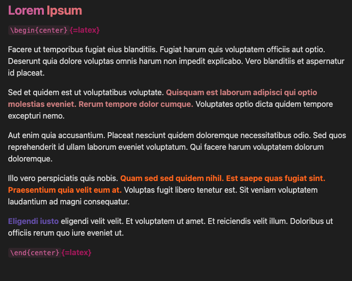

**Set-up**

1. Create a folder in your plugin folders (e.g., obsidian-auto-highlight)
2. Add to that folder the `manifest.json` and `main.js` files.
3. Add in the Obsidian settings page the strings that you want automatically highlighted!

**Example** 

 
